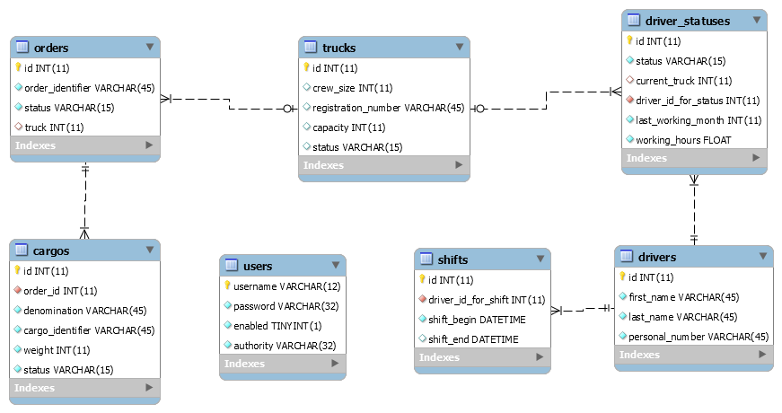

# logiweb
logiweb task

В задании требуется написать приложение, моделирующее работу информационной системы некоторой компании, осуществляющей перевозку грузов. Ниже более подробно описаны предметная область и технические требования.

DB schema:

